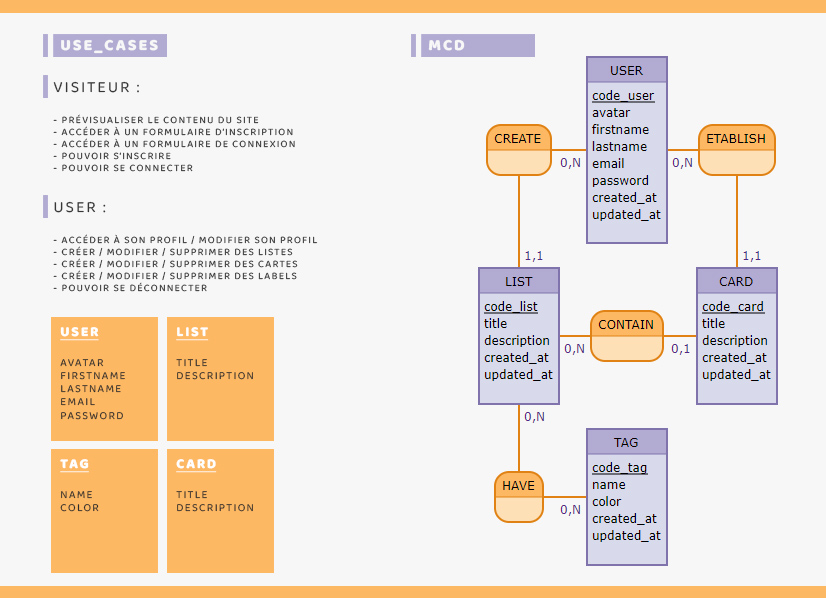
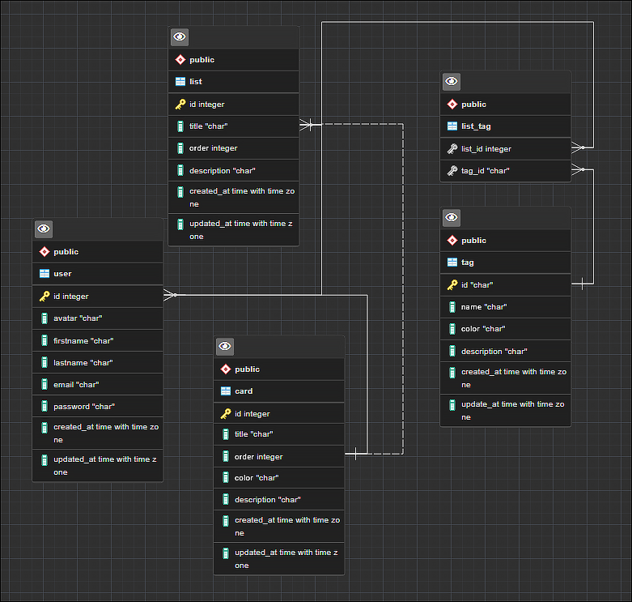

# Conception du projet O'Kanban

## User case et MCD

|        En tant que        |Je veux pouvoir |Dans le but de|
|----------------|-------------------------------|-----------------------------|
|Visiteur|   Accéder au site    |Visualiser le contenu du site            |
|Visiteur|   M'inscrire     |           |
|Visiteur|	Me connecter ||
||--||--|
|Utilisateur|Accéder à ma page profil |Visualiser mes infos|
|Utilisateur|Modifier mon profil |Mettre à jour mes infos|
|Utilisateur|Me déconnecter |Sortir de ma session|
|Utilisateur|Créer une liste| Rajouter une liste|
|Utilisateur|Créer une carte| Rajouter une carte dans ma liste|
|Utilisateur|Créer un label| Rajouter des labels à ma liste |
|Utilisateur|Modifier une liste|Mettre à jour ma liste|
|Utilisateur|Modifier une carte|Mettre à jour ma carte|
|Utilisateur|Modifier un label|Mettre à jour les labels liés à ma liste|
|Utilisateur|Supprimer une liste|--|
|Utilisateur|Supprimer une carte|--|
|Utilisateur|Supprimer un label|--|


### Etablissement du MCD sur [Mocodo](http://mocodo.wingi.net/)

```
CREATE, 0N USER, 11 LIST
USER: code_user, avatar, firstname, lastname, email, password, created_at, updated_at,
ETABLISH, 0N USER, 11 CARD

LIST: code_list, title, description, created_at, updated_at,
CONTAIN, 0N LIST, 01 CARD
CARD : code_card, title, description, created_at, updated_at,

HAVE, 0N LIST, 0N TAG
TAG : code_tag, name, color, created_at, updated_at,
:
```

Visualisation :



## MLD

```
USER ( code_user, avatar, firstname, lastname, email, password, created_at, updated_at, )
LIST ( code_list, title, description, created_at, updated_at, , code_user )
CARD ( code_card, title, description, created_at, updated_at, , code_user, code_list )
HAVE ( code_list, code_tag )
TAG ( code_tag, name, color, created_at, updated_at, )
```

## MPD

Mise en place du MPD 



