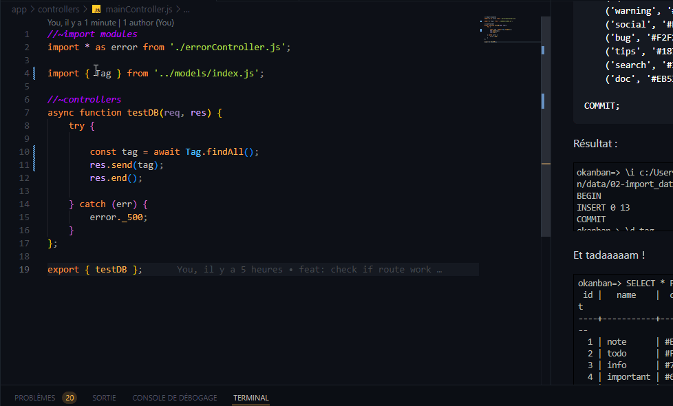

# Connecter la base de données 

On utilisera ici l'approche par Active Record avec Sequelize pour se connecter à la base de données.

## Environnement

On doit tout d'abord configurer notre environnement après avoir créé notre base de données.

Pour ça, on va définir les différents paramètres sur un fichier **.env** qui est absolument à cacher, personne, jamais personne ne doit le voir !! Et pour ça, il faut simplement le noter dans un fichier .gitignore

Pour montrer la façon dont on a configuré l'environnement, on peut ajouter un fichier .env.example

Voici mon exemple :

```
#MY_PORT=VALUE
PORT=4100

#DATABASE
DB_HOST=localhost
DB_USER=root
DB_PWD=secret
DB_PORT=5234

#INFO CONNEXION DB FOR PSQL new Client()
PGHOST=localhost
PGDATABASE=db_name
PGUSER=user
PGPASSWORD=password
PGPORT=5432

#SESSION
SESSION_SECRET=secret
```

Une fois la partie DATABASE configurée, on va vouloir récupérer les informations.

## Connexion de la DB avec Sequelize

Pour la connexion, on va utiliser le design pattern Active Record avec les models et on choisira de passer par l'[Object Relationnal Mapper](https://www.editions-eni.fr/open/mediabook.aspx?idR=4714ebb7e87f7c09fb040952bfd0b871) qui est [Sequelize](https://sequelize.org/docs/v6/)

Avant de gérer la connexion, on va aller sur notre point d'entrée qui est le fichier *index.js* principal et on va importer le module qui permet d'utiliser le fichier .env avec notre environnement.

Pour le travail sur les fichiers, nous avons choisi volontairement de faire les importations et exportations en utilisant l'ES6 Module System ([ici](https://ponyfoo.com/articles/es6-modules-in-depth#the-es6-module-system) une source intéressante sur le sujet)

Un example du fonctionnement :

```js
//~environment
import 'dotenv/config';
//~import modules
import express from 'express';
const app = express();
import session from 'express-session';
import { router } from './app/routes/index.js'

//~router
app.use(router);
//~error
app.use(error._400);

//~launch app
const PORT = process.env.PORT ?? 3000;

app.listen(PORT, () => {
    console.log(`Running server on http://localhost:${PORT}`);
});
```

Une fois le point d'entrée préparé, on va se connecter à la base de données dans notre fichier database.js

Les informations se feront de la manière suivante :

```js
//~import modules
import { Sequelize } from "sequelize";

//~connect to DB
function getConnexion() {

    return new Sequelize(
        process.env.DB_NAME,
        process.env.DB_USER,
        process.env.DB_PWD,

        {
            define: {
                createdAt: 'created_at',
                updatedAt: 'updated_at'
            },

            host: process.env.DB_HOST,
            dialect: process.env.DB_ENV,
            logging: false
        }
    )
    
};

export default getConnexion ;
```

Voilà, la base de données a bien été mise en place, tout est connecté, créeons maintenant nos models pour qu'on puisse les utiliser !

## Models

Dans notre dossier models, on a un point d'entrée qui va récupérer tous les models et les exporter afin qu'on puisse appeler qu'un seul fichier dans nos controllers.

On met tout ça dans un fichier index.js dédié aux models :

```js
import { User } from "./user.js";
import { List } from "./list.js";
import { Tag } from "./tag.js";
import { Card } from "./card.js";

export { User, List, Tag, Card };
```

Et pour chaque model, on va devoir établir le lien avec la base de données.

Un exemple pour rédiger son model :

```js
// ~ import modules
import { Model, DataTypes } from "sequelize";

// ~ connect to database
import getConnexion from "../database.js"
const sequelize = getConnexion();

class Tag extends Model { };

Tag.init({
    id: {
        type: DataTypes.INTEGER,
        primaryKey: true,
        autoIncrement: true,
        unique: true,
        allowNull: false
    },
    name: {
        type: DataTypes.TEXT,
        allowNull: false,
    },
    color: {
        type: DataTypes.TEXT,
        allowNull: true,
    },
    created_at: {
        type: DataTypes.DATE,
        defaultValue: DataTypes.NOW,
        allowNull: false
    },
    updated_at: {
        type: DataTypes.DATE,
        allowNull: true
    },
},
    {
        sequelize,
        tableName: "tag"
    }
);

export { Tag };
```

Et une fois le tout fait, on a plus qu'à appeler ce qu'on veut pour tester !

Ici, nous avons fait les tests sur notre controller :

```js
//~import modules
import * as error from './errorController.js';

import { User } from '../models/index.js';

//~controllers
async function testDB(req, res) {
    try {
        
        const user = await User.findAll();
        res.send(user);
        res.end();

    } catch (err) {
        error._500;
    }
};

export { testDB };
```

TADAAAAM !



## Association des tables

L'établissement des associations permet de relier les tables entre elles.

Tous les indices sont notés dans la table en elle-même. Pour chercher les informations, on rentre dans la table sur la console en faisant :

```sql
\d user --ou autre nom de table
```

On verra appraître ces informations :


Vous trouverez ces indices en-dessous de la table :

```shell
Index :
    "user_pkey" PRIMARY KEY, btree (id)
    "user_email_key" UNIQUE CONSTRAINT, btree (email)
Référencé par :
    TABLE "card" CONSTRAINT "card_user_id_fkey" FOREIGN KEY (user_id) REFERENCES "user"(id)
    TABLE "list" CONSTRAINT "list_user_id_fkey" FOREIGN KEY (user_id) REFERENCES "user"(id)
```

On voit grâce aux 2 dernières lignes que la table ***user*** est aussi référencée dans la table ***card*** et la table ***list*** et la clé étrangère qui va lier ces tables avec ***user***.

Cette information nous permet de montrer qu'il y a un lien par le biais de ***user_id*** et nous permet déjà d'en déduire qu'on va faire une association entre *user* avec *card* et *user* avec *list*

Une association avec Sequelize permet d'établir un lien dans un sens mais il faut également établir le lien dans l'autre sens. On aura donc une association et sa réciproque.

Voici donc les associations pour nos tables :

```js
//~import modules
import { User } from './user.js';
import { List } from './list.js';
import { Tag } from './tag.js';
import { Card } from './card.js';

//~associations
//^ ---------------------------- USER - LIST
User.hasMany(List, {
    foreignKey: 'user_id',
    as: 'lists'
});

List.belongsTo(User, {
    foreignKey: 'user_id',
    as: 'user'
});

//^ ---------------------------- USER - CARD
User.hasMany(Card, {
    foreignKey: 'user_id',
    as: 'cards'
});

Card.belongsTo(User, {
    foreignKey: 'user_id',
    as: 'user'
});

//^ ---------------------------- CARD - LIST
Card.belongsTo(List, {
    foreignKey: 'list_id',
    as: 'list'
});

List.hasMany(Card, {
    foreignKey: 'list_id',
    as: 'cards'
});

//^ ---------------------------- CARD_HAS_TAG
Card.belongsToMany(Tag, {
    foreignKey: 'card_id',
    through: 'card_has_tag',
    otherKey: 'tag_id',
    as: 'tags'
});

Tag.belongsToMany(Card, {
    foreignKey: 'tag_id',
    through: 'card_has_tag',
    otherKey: 'card_id',
    as: 'cards'
});


export { User, List, Tag, Card };

```

L'association avec la table pivot est particulière, il faut indiquer les 2 clés qu'on récupère et la clé par laquelle ces id passent de cette manière :

```js
//^ ---------------------------- CARD_HAS_TAG
Card.belongsToMany(Tag, {
    foreignKey: 'card_id',
    through: 'card_has_tag',
    otherKey: 'tag_id',
    as: 'tags'
});

Tag.belongsToMany(Card, {
    foreignKey: 'tag_id',
    through: 'card_has_tag',
    otherKey: 'card_id',
    as: 'cards'
});
```

On retrouve donc la clé étrangère, passant par la clé de la table pivot et l'autre clé.


[Retour à la page d'accueil](/README.md)
