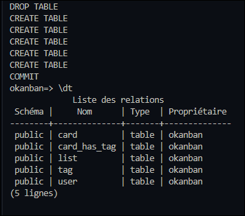
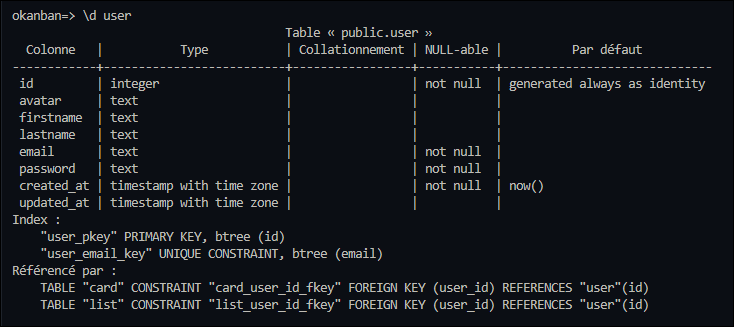
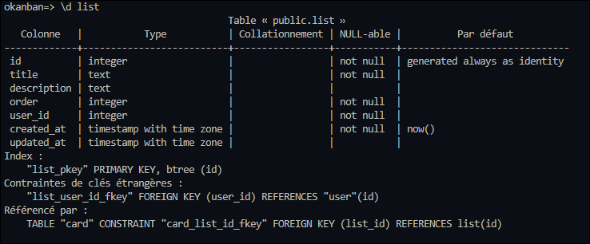
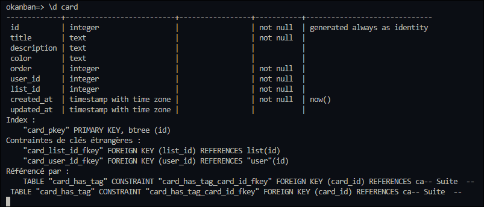
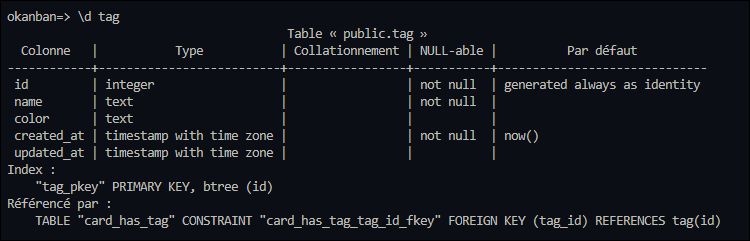
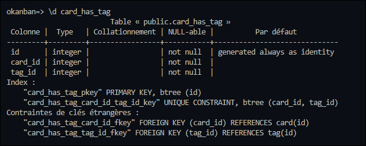
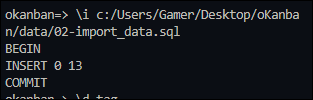
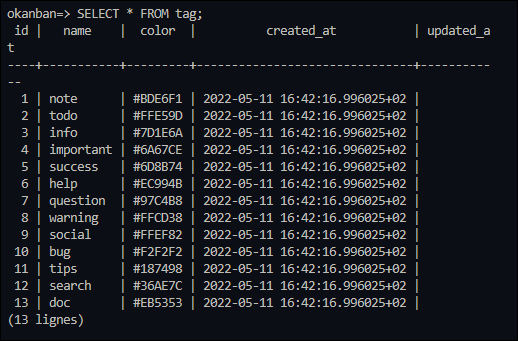

# Database

## Créer la base de données

On Win :

```shell
psql -U postgres
```

```sql
CREATE USER okanban WITH PASSWORD 'okanban'
```

```sql
CREATE DATABASE okanban OWNER 'okanban'
```

- Check si on peut se connecter

```shell
\c okanban okanban
```
- Check si on a bien okanban dans notre liste

```shell
\l
```


## Syntaxes à respecter

On va écrire notre SQL pour créer la DB, dans un premier temps, il faut ouvrir un nouveau fichier sql.

- une clé primaire est automatiquement **NOT NULL**. Pas besoin de le préciser lors de la création d'une table.

- On spécifie que la colonne sera généré automatiquement par la BDD en suivant une séquence numérique prédéfinie de 1 en 1

- On peut définir **BY DEFAULT** (surcharge de la valeur possible) ou **ALWAYS** (surcharge de la valeur impossible)

- Ici on utilise BY DEFAULT car on défini nous même les valeurs des clé primaires dans les insertions du fichier import_data.sql

- Mais on utilisera plus généralement ALWAYS afin de sécurisé l'incrémentation des valeurs du champ

```sql
BEGIN; --Toujours commencer par BEGIN pour démarrer la transaction

 --On supprime d'abord les tables existantes si elles existent
DROP TABLE IF EXISTS "table_1",
"table_2"; --Ne pas oublier de refermer

--~role
CREATE TABLE IF NOT EXISTS "role" (
    "id" INTEGER GENERATED BY DEFAULT AS IDENTITY PRIMARY KEY, --Ecriture moderne
    "name" TEXT NOT NULL DEFAULT 'user',
    "created_at" TIMESTAMPTZ NOT NULL DEFAULT CURRENT_TIMESTAMP,
    "updated_at" TIMESTAMPTZ
);

--~user
CREATE TABLE IF NOT EXISTS "user" (
    "id" INTEGER GENERATED BY DEFAULT AS IDENTITY PRIMARY KEY,
    "username" TEXT NOT NULL UNIQUE,
    "email" TEXT NOT NULL UNIQUE,
    "password" TEXT NOT NULL,
    "role_id" INTEGER NOT NULL REFERENCES "role"("id"),
    "created_at" TIMESTAMPTZ NOT NULL DEFAULT CURRENT_TIMESTAMP,
    "updated_at" TIMESTAMPTZ
);

--~category
CREATE TABLE IF NOT EXISTS "category" (
    "id" INTEGER GENERATED BY DEFAULT AS IDENTITY PRIMARY KEY,
    "name" TEXT NOT NULL,
    "description" TEXT NULL,
    "image" TEXT NULL,
    "user_id" INTEGER NOT NULL REFERENCES "user"("id"),
    "created_at" TIMESTAMPTZ NOT NULL DEFAULT NOW(),
    "updated_at" TIMESTAMPTZ
);

--~snippet
CREATE TABLE IF NOT EXISTS "snippet" (
    "id" INTEGER GENERATED BY DEFAULT AS IDENTITY PRIMARY KEY,
    "title" TEXT NOT NULL,
    "description" TEXT NULL,
    "link" TEXT NULL,
    "date" TEXT NOT NULL,
    "user_id" INTEGER NOT NULL REFERENCES "user"("id"),
    "created_at" TIMESTAMPTZ NOT NULL DEFAULT CURRENT_TIMESTAMP,
    "updated_at" TIMESTAMPTZ
);

--~category_has_snippet
CREATE TABLE IF NOT EXISTS "category_has_snippet" (
    "id" INTEGER GENERATED BY DEFAULT AS IDENTITY PRIMARY KEY,
    "category_id" INTEGER NOT NULL REFERENCES "category"("id"),
    "snippet_id" INTEGER NOT NULL REFERENCES "snippet"("id"),
    "created_at" TIMESTAMPTZ NOT NULL DEFAULT CURRENT_TIMESTAMP,
    "updated_at" TIMESTAMPTZ,
    UNIQUE("category_id", "snippet_id")
);

COMMIT; -- Fin de la transaction
```

Si les clés primaires sont générées par défault, pour éviter tout problème on ajoute :

```sql
SELECT setval('category_id_seq', (SELECT MAX(id) from "category"));
```

Ci-dessous un modèle type d'une importation de données :

```sql
BEGIN;

INSERT INTO "role"("id","name")
VALUES 
 (1, 'admin'), 
 (2, 'user');

INSERT INTO "user"
    ("id","username","email","password", "role_id")
VALUES 
 (1, 'admin', 'admin@admin.com','admin', 1);

SELECT setval('category_id_seq', (SELECT MAX(id) from "category"));
SELECT setval('role_id_seq', (SELECT MAX(id) from "role"));
SELECT setval('user_id_seq', (SELECT MAX(id) from "user"));
SELECT setval('snippet_id_seq', (SELECT MAX(id) from "snippet"));
SELECT setval('user_id_seq', (SELECT MAX(id) from "user"));

COMMIT;
```

Import create_db.sql dans okanban

```shell
\i c:/Users/Gamer/Desktop/oKanban/data/01-create_db.sql 
```

Résultat : 



Check de toutes les tables créées :

- Pour l'utilisateur :


- Pour la liste


- Pour les cartes


- Pour les tags


- Pour la table pivot




## Importer des données 

Si on veut insérer des données, on peut créer sur un fichier à part les informations qu'on veut saisir

```shell
BEGIN;

INSERT INTO "tag"("name", "color")
VALUES
    ('note', '#BDE6F1'),
    ('todo', '#FFE59D'),
    ('info', '#7D1E6A'),
    ('important', '#6A67CE'),
    ('success', '#6D8B74'),
    ('help', '#EC994B'),
    ('question', '#97C4B8'),
    ('warning', '#FFCD38'),
    ('social', '#FFEF82'),
    ('bug', '#F2F2F2'),
    ('tips', '#187498'),
    ('search', '#36AE7C'),
    ('doc', '#EB5353');

COMMIT;
```

Résultat :



Et tadaaaaam


